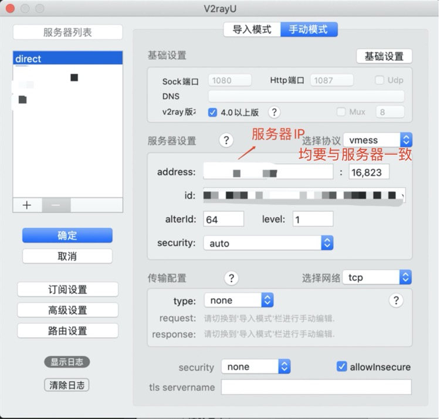
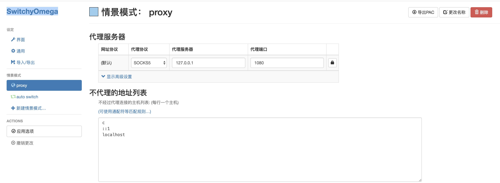

# v2ray最简单方案

采用Vmess协议 + tcp + Tls 速度可以，稳定性更好

参考[v2ray之VPS的IP被封WebSockets(ws)+TLS+Nginx+Cloudflare](v2ray之VPS的IP被封WebSockets(ws)+TLS+Nginx+Cloudflare.md)

只需要参考证书安装,域名注册部分,不需要关注CDN及Nginx部分

## 1.拥有一个VPS服务器
推荐digital ocean 便宜又不容易被封

链接https://www.digitalocean.com/

## 2.登陆服务器，配置v2ray服务器端
### 安装v2ray(两种方法，第二种方便升级更新)
#### 一键安装
`bash <(curl -L -s https://install.direct/go.sh)`
#### 脚本安装
下载脚本

`wget https://install.direct/go.sh`

安装脚本

`sudo bash go.sh`

升级更新

在 VPS，重新执行一遍安装脚本就可以更新了，在更新过程中会自动重启 V2Ray，配置文件保持不变。

`sudo bash go.sh`

### 启动v2ray(每次修改配置记得重启)
`service v2ray restart`

控制 V2Ray 的运行的常用命令:

`service v2ray restart | force-reload |start|stop|status|reload`

修改配置文件(可参考mkcp+dynamicport目录下的json,后续还会继续更新)
`sudo nano /etc/v2ray/config.json`

服务器端配置如下

```
{
  "log": {
    "loglevel": "debug",
    "access": "/var/log/v2ray/access.log",
    "error": "/var/log/v2ray/error.log"
  },
  "inbounds": [
    {
      "port": 443,
      "protocol": "vmess",    
      "settings": {
        "clients": [
          {
            "id": "ae6bb8de-3061-4014-8986-1f566c5ddbea",  
            "alterId": 64,
            "level": 1``
          }
        ]
      },
      "streamSettings": {
        "network": "tcp",
        "security": "tls", // security 要设置为 tls 才会启用 TLS
        "tlsSettings": {
          "certificates": [
            {
              "certificateFile": "/etc/v2ray/v2ray.crt", // 证书文件
              "keyFile": "/etc/v2ray/v2ray.key" // 密钥文件
            }
          ]
        }
      }
    }
  ],
  "outbounds": [
    {
      "protocol": "freedom",
      "settings": {}
    },
    {
      "protocol": "blackhole",
      "settings": {},
      "tag": "blocked"
    }
  ],
  "routing": {
    "rules": []
  }
}
```

测试V2Ray配置文件:
`/usr/bin/v2ray/v2ray -test -config /etc/v2ray/config.json`

如果是配置文件没问题，则是这样的:
```
$ /usr/bin/v2ray/v2ray -test -config /etc/v2ray/config.json
V2Ray v3.15 (die Commanderin) 20180329
An unified platform for anti-censorship.
Configuration OK.
```
## 3.验证

一般来说，按照以上步骤操作完成，V2Ray 客户端能够正常联网说明 TLS 已经成功启用。但要是有个可靠的方法来验证是否正常开启 TLS 无疑更令人放心。
验证的方法有很多，我仅介绍一种小白化一点的，便是 [Qualys SSL Labs's SSL Server Test](https://www.ssllabs.com/ssltest/index.html)。

**注意：使用 Qualys SSL Labs's SSL Server Test 要求使用 443 端口，意味着你服务器配置的 inbound.port 应当是 443**

打开 [Qualys SSL Labs's SSL Server Test](https://www.ssllabs.com/ssltest/index.html)，在
Hostname 中输入你的域名，点提交，过一会结果就出来了。

## 4.Mac端配置
使用的是[V2rayU](https://github.com/yanue/V2rayU/releases)(第三方开发)

正常安装程序,点击应用程序中的 V2RayU 图标:勾选 pac 模式、点击服务器设置


配置


## 5.Mac Chrome配置
安装 SwitchyOmega 插件, chrome插件安装请自行百度，安装包已上传

配置如下


## 6.Androi配置
下载安装BifrostV(已上传)

BifrostV_v0.6.8_apkpure.com .apk

按照提示填写配置即可