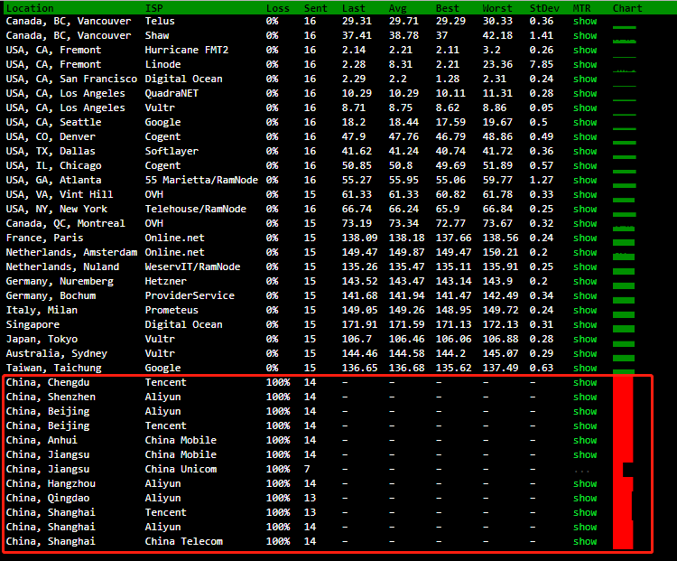
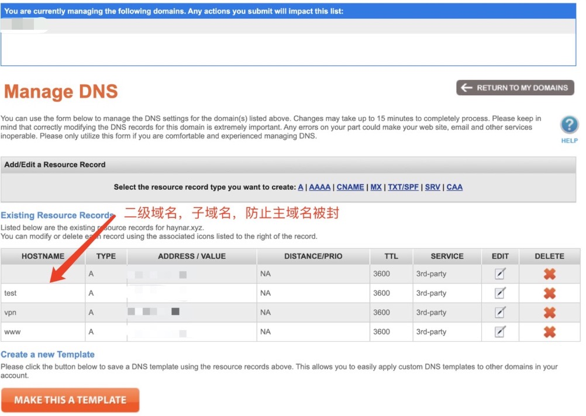
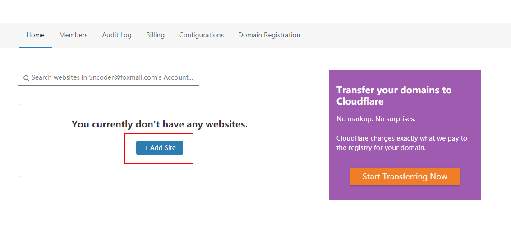
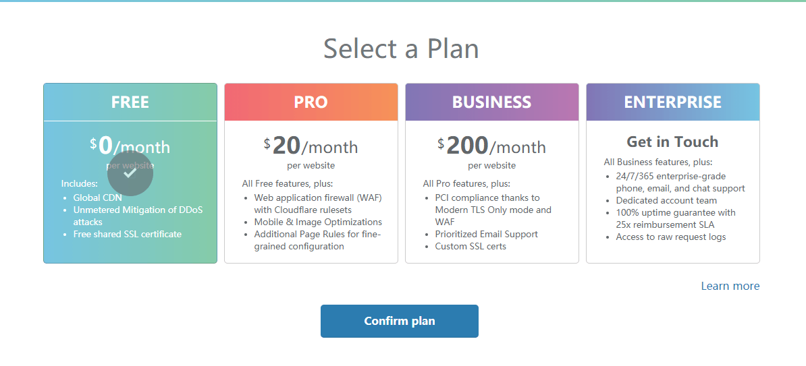
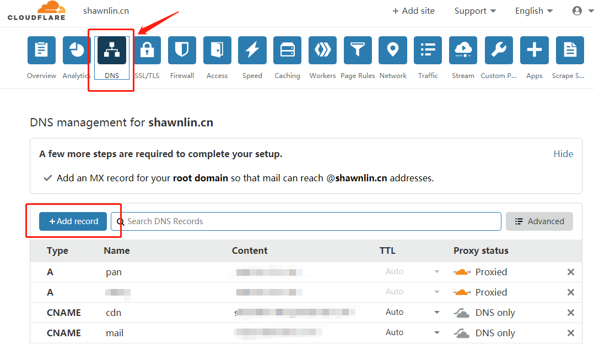
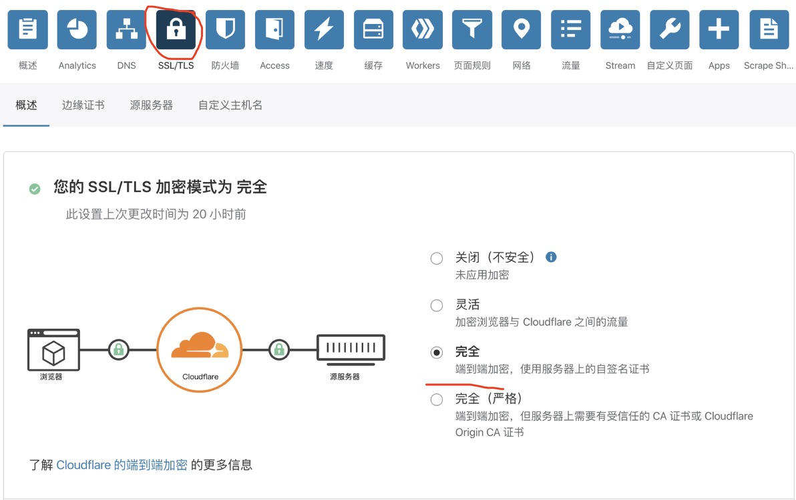
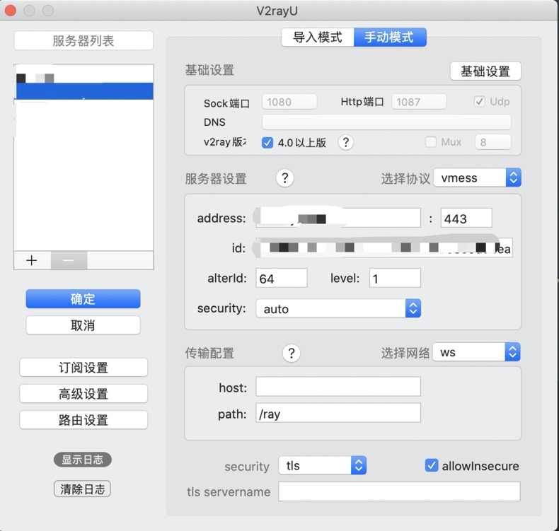

# v2ray之VPS的IP被封WebSockets(ws)+TLS+Nginx+Cloudflare

参考文章
* [搬瓦工vps的IP被封(10) V2Ray+WebSocket(ws)+TLS+Nginx+Cloudflare](https://eveaz.com/1107.html)

* [免费CDN + V2Ray解封被墙VPS](https://www.shawnlin.cn/49b54080/#%E6%A3%80%E6%B5%8BVPS%E6%98%AF%E5%90%A6%E8%A2%AB%E5%A2%99)

## 1.检测VPS是否被墙

通过 http://ping.pe/ 检测IP是否被墙, 输入自己服务器的IP后，点击GO按钮。如果出现以下情况，国外节点通绿色，国内节点红色，基本可以判断此IP被GWF封了。


如果VPS被墙后,就可以通过以下教程给自己的VPS套上CDN,就能让VPS死而复生了。

## 2.注册一个域名

如果已经注册有域名了可以跳过。
TLS 需要一个域名，域名有免费的和有付费的，如果你不舍得为一个域名每年花点钱，用个免费域名也可以，但总体来说付费的会优于免费的，我看到有网友因为用了免费域名，结果出现域名解析故障而翻墙失败。所以，还是推荐买个便宜点的域名。关于域名注册商，推荐[namesilo](https://www.namesilo.com/register.php?rid=43ac240wm) ,这家域名商有不少便宜的域名选择，比如.xyz域名，一年才0.99美元，很便宜，而且可选择免费域名隐私保护。为了方便，在本文中我就忽略如何注册购买域名了。关于如何获取域名，具体可搜索相关文章教程。

**注册好域名之后务必记得添加一个 A 记录指向你的 VPS!**

另外，为了避免主域名被封锁，推荐先使用子域名，所以预备一些子域名也 A 记录指向你的 VPS! 比如：
v01.mydomain.me v02.mydomain.me v03.mydomain.me v04.mydomain.me v05.mydomain.me v06.mydomain.me v07.mydomain.me v08.mydomain.me v09.mydomain.me
V2Ray 是一个与 Shadowsocks 类似的代理软件，可以用来科学上网（翻墙）学习国外先进科学技术。



**以下假设注册的域名为 v3.mydomain.xyz，请将之替换成自己的域名。**

## 3.使用CloudFlare 免费CDN

CloudFlare 是一家全球知名的 CDN 服务商，并且提供了免费的 CDN 套餐，而且不限流量，所以我们完全不需要花一分钱就能使用它的 CDN 服务，接下来我就说明如何注册并使用CloudFlare

### 3.1首先打开CloudFlare 官网 https://www.cloudflare.com/，注册一个账号，注册流程很简单，只需要邮箱就行了.
### 3.2使用 CloudFlare 管理域名
注册完成后登录账号，点击 Add site，这个功能的作用是将域名交给 CloudFlare 管理，这样 CloudFlare 才能给你的域名分配 CDN。

### 3.3选择Free套餐

### 3.4修改DNS解析服务器(会有相关提示,需要去域名注册网站修改)
### 3.5添加域名解析记录
修改DNS域名解析服务器后, 按之前的解析记录，添加到CloudFlare里即可,橘色云朵代表流量通过 CloudFlare 的 CDN，灰色云朵代表不通过 CDN，点击一下云朵即可切换。

### 3.6模式一定要改为Full


## 4.ssh登陆服务器
如果服务器被封无法ssh，可以通过代理去ssh登陆

`ssh -o ProxyCommand="nc -X 5 -x 127.0.0.1:1080 %h %p" user@server`

## 5.证书生成

TLS 是证书认证机制，所以使用 TLS 需要证书，证书也有免费付费的，同样的这里使用免费证书，证书认证机构为 [Let's Encrypt](https://letsencrypt.org/)。
证书的生成有许多方法，这里使用的是比较简单的方法：使用 [acme.sh](https://github.com/Neilpang/acme.sh) 脚本生成，本部分说明部分内容参考于[acme.sh README](https://github.com/Neilpang/acme.sh/blob/master/README.md)。

证书有两种，一种是 ECC 证书（内置公钥是 ECDSA 公钥），一种是 RSA 证书（内置 RSA 公钥）。简单来说，同等长度 ECC 比 RSA 更安全,也就是说在具有同样安全性的情况下，ECC 的密钥长度比 RSA 短得多（加密解密会更快）。但问题是 ECC 的兼容性会差一些，Android 4.x 以下和 Windows XP 不支持。只要您的设备不是非常老的老古董，建议使用 ECC 证书。

以下将给出这两类证书的生成方法，请大家根据自身的情况自行选择其中一种证书类型。

证书生成只需在服务器上操作。

### 5.1安装 acme.sh

执行以下命令，acme.sh 会安装到 ~/.acme.sh 目录下。
```
$ curl  https://get.acme.sh | sh
  % Total    % Received % Xferd  Average Speed   Time    Time     Time  Current
                                 Dload  Upload   Total   Spent    Left  Speed
100   775    0   775    0     0   2406      0 --:--:-- --:--:-- --:--:--  2406
  % Total    % Received % Xferd  Average Speed   Time    Time     Time  Current
                                 Dload  Upload   Total   Spent    Left  Speed
100  191k  100  191k    0     0  2559k      0 --:--:-- --:--:-- --:--:-- 2559k
[Thu Apr  2 12:27:23 UTC 2020] Installing from online archive.
[Thu Apr  2 12:27:23 UTC 2020] Downloading https://github.com/acmesh-official/acme.sh/archive/master.tar.gz
[Thu Apr  2 12:27:23 UTC 2020] Extracting master.tar.gz
[Thu Apr  2 12:27:24 UTC 2020] It is recommended to install socat first.
[Thu Apr  2 12:27:24 UTC 2020] We use socat for standalone server if you use standalone mode.
[Thu Apr  2 12:27:24 UTC 2020] If you don't use standalone mode, just ignore this warning.
[Thu Apr  2 12:27:24 UTC 2020] Installing to /root/.acme.sh
[Thu Apr  2 12:27:24 UTC 2020] Installed to /root/.acme.sh/acme.sh
[Thu Apr  2 12:27:24 UTC 2020] Installing alias to '/root/.bashrc'
[Thu Apr  2 12:27:24 UTC 2020] OK, Close and reopen your terminal to start using acme.sh
[Thu Apr  2 12:27:24 UTC 2020] Installing cron job
no crontab for root
no crontab for root
[Thu Apr  2 12:27:24 UTC 2020] Good, bash is found, so change the shebang to use bash as preferred.
[Thu Apr  2 12:27:24 UTC 2020] OK
[Thu Apr  2 12:27:24 UTC 2020] Install success!

```
安装成功后执行 `source ~/.bashrc` 以确保脚本所设置的命令别名生效。

如果安装报错，那么可能是因为系统缺少 acme.sh 所需要的依赖项，acme.sh 的依赖项主要是 netcat(nc)，我们通过以下命令来安装这些依赖项，然后重新安装一遍 acme.sh:

```
$ sudo apt-get -y install netcat
```


### 5.2使用 acme.sh 生成证书

#### 如果报错 Please install socat tools first.

如果生成证书时报错 `......Please install socat tools first.` , 请先执行以下命令：

`apt-get install socat`  or  `yum install socat`

#### 单独域名证书生成
此步骤仅仅生产一个域名的证书，为了防止主域名被封锁，我们可以同时生成一些子域名证书，使用的时候先使用子域名，如果子域名被封了，可以再换一个子域名来用，不用重新申请新的域名。而如果直接使用主域名，主域名一旦被封，就只能申请新域名了。如果想同时生成一些子域名，请跳过此步骤，直接看后文：同时生成多个子域名证书。

执行以下命令生成主域名证书：
以下的命令会临时监听 80 端口，请确保执行该命令前 80 端口没有使用
```
$ sudo ~/.acme.sh/acme.sh --issue -d v3.mydomain.xyz --standalone -k ec-256
[Fri Dec 30 08:59:12 HKT 2016] Standalone mode.
[Fri Dec 30 08:59:12 HKT 2016] Single domain='vpn.haynar.xyz'
[Fri Dec 30 08:59:12 HKT 2016] Getting domain auth token for each domain
[Fri Dec 30 08:59:12 HKT 2016] Getting webroot for domain='mydomain.me'
[Fri Dec 30 08:59:12 HKT 2016] _w='no'
[Fri Dec 30 08:59:12 HKT 2016] Getting new-authz for domain='mydomain.me'
[Fri Dec 30 08:59:14 HKT 2016] The new-authz request is ok.
[Fri Dec 30 08:59:14 HKT 2016] mydomain.me is already verified, skip.
[Fri Dec 30 08:59:14 HKT 2016] mydomain.me is already verified, skip http-01.
[Fri Dec 30 08:59:14 HKT 2016] mydomain.me is already verified, skip http-01.
[Fri Dec 30 08:59:14 HKT 2016] Verify finished, start to sign.
[Fri Dec 30 08:59:16 HKT 2016] Cert success.
-----BEGIN CERTIFICATE-----
MIIEMTCC*BYMzAeFw0xNjEyMjkyMzU5MDBaFw0x
NzAzMjkyMzU5MDBaMBcxFTATBgNVBAMTDHdlYWtzYW5kLmNvbTBZMBMGByqGSM49
****************************************************************
*
-----END CERTIFICATE-----
[Fri Dec 30 08:59:16 HKT 2016] Your cert is in  /root/.acme.sh/mydomain.me_ecc/mydomain.me.cer
[Fri Dec 30 08:59:16 HKT 2016] Your cert key is in  /root/.acme.sh/mydomain.me_ecc/mydomain.me.key
[Fri Dec 30 08:59:16 HKT 2016] The intermediate CA cert is in  /root/.acme.sh/mydomain.me_ecc/ca.cer
[Fri Dec 30 08:59:16 HKT 2016] And the full chain certs is there:  /root/.acme.sh/mydomain.me_ecc/fullchain.cer
```
`-k` 表示密钥长度，后面的值可以是 `ec-256` 、`ec-384`、`2048`、`3072`、`4096`、`8192`，带有 `ec` 表示生成的是 ECC 证书，没有则是 RSA 证书。在安全性上 256 位的 ECC 证书等同于 3072 位的 RSA 证书。

#### 同时生成多个子域名证书

执行以下命令生成多个子域名证书:
以下的命令会临时监听 80 端口，请确保执行该命令前 80 端口没有使用，并确保所有子域名的A记录到VPS的ip地址。
```
$ sudo ~/.acme.sh/acme.sh --issue --standalone -k ec-256 -d mydomain.xyz -d www.mydomain.xyz -d test.mydomain.xyz
```

#### 证书更新

由于 Let's Encrypt 的证书有效期只有 3 个月，因此需要 90 天至少要更新一次证书，acme.sh 脚本会每 60 天自动更新证书。也可以手动更新。

手动更新 ECC 证书，执行：
```
$ sudo ~/.acme.sh/acme.sh --renew -d v3.mydomain.xyz --force --ecc
```
或者同时更新子域名，执行：
```
$ sudo ~/.acme.sh/acme.sh --renew -d v3.mydomain.xyz -d test.mydomain.xyz
```

如果是 RSA 证书则执行：
```
$ sudo ~/.acme.sh/acme.sh --renew -d vpn.mydomain.xyz --force
```
或者同时更新子域名，执行：
```
$ sudo ~/.acme.sh/acme.sh --renew -d vpn.mydomain.xyz -d test.mydomain.xyz
```

**由于本例中将证书生成到 `/etc/v2ray/` 文件夹，更新证书之后还得把新证书生成到 /etc/v2ray。**

### 5.3安装证书和密钥

#### ECC 证书

将证书和密钥安装到 /etc/v2ray 中：
```
$ sudo ~/.acme.sh/acme.sh --installcert -d v3.mydomain.xyz --fullchainpath /etc/v2ray/v2ray.crt --keypath /etc/v2ray/v2ray.key --ecc
```
或者同时将子域名证书和密钥安装到 /etc/v2ray 中：
```
$ sudo ~/.acme.sh/acme.sh --installcert -d v3.mydomain.xyz -d test.mydomain.xyz --fullchainpath /etc/v2ray/v2ray.crt --keypath /etc/v2ray/v2ray.key --ecc
```

#### RSA 证书

```
$ sudo ~/.acme.sh/acme.sh --installcert -d v3.mydomain.xyz --fullchainpath /etc/v2ray/v2ray.crt --keypath /etc/v2ray/v2ray.key
```
或者同时将子域名证书和密钥安装到 /etc/v2ray 中：
```
$ sudo ~/.acme.sh/acme.sh --installcert -d mydomain.me -d www.mydomain.me -d v01.mydomain.me -d v02.mydomain.me -d v03.mydomain.me -d v04.mydomain.me -d v05.mydomain.me -d v06.mydomain.me -d v07.mydomain.me -d v08.mydomain.me -d v09.mydomain.me --fullchainpath /etc/v2ray/v2ray.crt --keypath /etc/v2ray/v2ray.key
```

**注意：无论什么情况，密钥(即上面的v2ray.key)都不能泄漏，如果你不幸泄漏了密钥，可以使用 acme.sh 将原证书吊销，再生成新的证书，吊销方法请自行参考 acme.sh 的手册**

## 6.Nginx 配置

Nginx 彻底卸载(看自己情况)
```
sudo apt-get remove nginx nginx-common # 卸载删除除了配置文件以外的所有文件。
sudo apt-get purge nginx nginx-common # 卸载所有东东，包括删除配置文件。
sudo apt-get autoremove # 在上面命令结束后执行，主要是卸载删除Nginx的不再被使用的依赖包。
sudo apt-get remove nginx-full nginx-common #卸载删除两个主要的包。
```

Nginx 安装

`sudo apt install nginx`

设置开机启动：

`systemctl enable nginx`

新建一个Nginx站点配置文件：

`sudo nano /etc/nginx/conf.d/v2ray.conf`

写入
```
server {
   listen 443 ssl;
   ssl on;
   ssl_certificate       /etc/v2ray/v2ray.crt;
   ssl_certificate_key   /etc/v2ray/v2ray.key;
   ssl_protocols         TLSv1 TLSv1.1 TLSv1.2;
   ssl_ciphers           HIGH:!aNULL:!MD5;
   server_name           v3.mydomain.xyz;
     location /ray {
       proxy_redirect off;
       proxy_pass http://127.0.0.1:10086;
       proxy_http_version 1.1;
       proxy_set_header Upgrade $http_upgrade;
       proxy_set_header Connection "upgrade";
       proxy_set_header Host $host;
       proxy_set_header X-Real-IP $remote_addr;
       proxy_set_header X-Forwarded-For $proxy_add_x_forwarded_for;
    }
}
```

启动Nginx

`systemctl restart nginx`

控制 Nginx 的运行的常用命令:

`systemctl restart |start|stop|status nginx`

## 7.配置 V2Ray

安装 v2ray 请参考[v2ray最简单方案](v2ray最简方案.md)

在这里需要额外配置 WebSocket,定义路径/ray, 与 nginx location需要一致, tls 不需要配置,这个证书在 nginx 里会配置

### 服务器
```
{
  "log": {
    "loglevel": "debug",
    "access": "/var/log/v2ray/access.log",
    "error": "/var/log/v2ray/error.log"
  },
  "inbounds": [
    {
      "port": 10086,
      "listen": "127.0.0.1",
      "protocol": "vmess",
      "settings": {
        "clients": [
          {
            "id": "ae6bb8de-3061-4014-8986-1f566c5ddbea",
            "level": 1,
            "alterId": 64
          }
        ]
      },
      "streamSettings": {
        "network": "ws",
        "wsSettings": {
          "path": "/ray"
        }
      }
    }
  ],
  "outbounds": [
    {
      "protocol": "freedom",
      "settings": {}
    },
    {
      "protocol": "blackhole",
      "settings": {},
      "tag": "blocked"
    }
  ],
  "routing": {
    "rules": []
  }
}
```

测试V2Ray配置文件:

`/usr/bin/v2ray/v2ray -test -config /etc/v2ray/config.json`

重启v2ray
```
service v2ray restart
```

### 客户端
Mac 使用V2rayU



Android配置

下载安装BifrostV(已上传)

BifrostV_v0.6.8_apkpure.com .apk

按照提示填写配置即可
