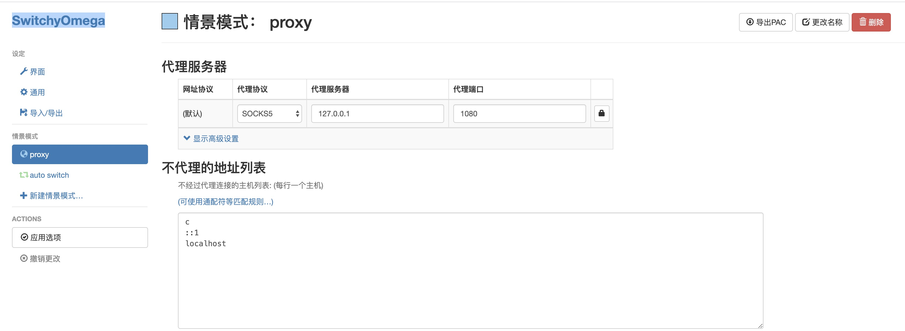

# v2ray最简单方案

采用Vmess协议 + tcp 速度可以，但稳定性一般

## 1.拥有一个VPS服务器
推荐digital ocean 便宜又不容易被封

链接https://www.digitalocean.com/

## 2.登陆服务器，配置v2ray服务器端
### 安装v2ray(两种方法，第二种方便升级更新)
#### 一键安装

`bash <(curl -L -s https://install.direct/go.sh)`

#### 脚本安装
下载脚本

`wget https://install.direct/go.sh`

安装脚本

`sudo bash go.sh`

升级更新

在 VPS，重新执行一遍安装脚本就可以更新了，在更新过程中会自动重启 V2Ray，配置文件保持不变。

`sudo bash go.sh`

### 启动v2ray(每次修改配置记得重启)
`service v2ray restart`

控制 V2Ray 的运行的常用命令:

`service v2ray restart | force-reload |start|stop|status|reload`

修改配置文件

`sudo nano /etc/v2ray/config.json`

服务器端配置如下
```
{
  "log": {
    "loglevel": "warning",
    "access": "/var/log/v2ray/access.log",
    "error": "/var/log/v2ray/error.log"
  },
  "inbounds": [
    {
      "port": 16823,
      "protocol": "vmess",    
      "settings": {
        "clients": [
          {
            "id": "ae6bb8de-3061-4014-8986-1f566c5ddbea", 
            "level": 1,
            "alterId": 64
          }
        ]
      }
    }
  ],
  "outbounds": [
    {
      "protocol": "freedom",
      "settings": {}
    }
  ]
}
```
* port 服务器监听端口,需要与客户端Vmess中的端口一致

* id 使用的是 UUID 的格式，我们可以使用任何 UUID 生成工具生成 UUID 作为这里的 id。比如 [UUID Generator](https://www.uuidgenerator.net/) 这个网站
配置中还有一个 alterId 参数，这个参数主要是为了加强防探测能力。理论上 alterId 越大越好，但越大就约占内存(只针对服务器，客户端不占内存)，所以折中之下设一个中间值才是最好的。那么设多大才是最好的？其实这个是分场景的，我没有严格测试过这个，不过根据经验，alterId 的值设为 30 到 100 之间应该是比较合适的。alterId 的大小要保证客户端的小于等于服务器的。

测试V2Ray配置文件:
`/usr/bin/v2ray/v2ray -test -config /etc/v2ray/config.json`

如果是配置文件没问题，则是这样的:
```
$ /usr/bin/v2ray/v2ray -test -config /etc/v2ray/config.json
V2Ray v3.15 (die Commanderin) 20180329
An unified platform for anti-censorship.
Configuration OK.
```

## 3.Google BBR 一键加速VPS服务器

BBR是Google的一套网络拥塞控制算法，用在VPS服务器上，可以有效减少拥堵丢包，大幅提高网络连接和翻墙速度。
目前很多Linux类系统的最新内核，都已内置BBR。所以，不再需要第三方的安装脚本了。直接修改系统配置即可。

Google BBR 一键加速VPS服务器很简单，SSH登录VPS后，分别执行以下2个命令即可（鼠标选中高亮后，点鼠标右键复制粘贴到root用户的#后面，然后回车）。

命令1(比较长，有折行，请完整拷贝)：

`wget https://raw.githubusercontent.com/bannedbook/fanqiang/master/v2ss/server-cfg/sysctl.conf -O -> /etc/sysctl.conf`

如果提示 wget: command not found 的错误，这是你的系统精简的太干净了，wget都没有安装，所以需要安先装 wget:

`apt-get install -y wget`

命令2：

`sysctl -p`

执行成功后大致会输出：
```
fs.file-max = 51200
net.ipv4.conf.lo.accept_redirects = 0
net.ipv4.conf.all.accept_redirects = 0
net.ipv4.conf.default.accept_redirects = 0
net.ipv4.ip_local_port_range = 10000 65000
net.ipv4.tcp_fin_timeout = 15
net.ipv4.tcp_fastopen = 3
net.ipv4.tcp_keepalive_time = 1200
net.ipv4.tcp_rmem = 32768 436600 873200
net.ipv4.tcp_syncookies = 1
net.ipv4.tcp_synack_retries = 2
net.ipv4.tcp_syn_retries = 2
net.ipv4.tcp_timestamps = 0
net.ipv4.tcp_max_tw_buckets = 9000
net.ipv4.tcp_max_syn_backlog = 65536
net.ipv4.tcp_mem = 94500000 91500000 92700000
net.ipv4.tcp_max_orphans = 3276800
net.ipv4.tcp_mtu_probing = 1
net.ipv4.tcp_wmem = 8192 436600 873200
net.core.netdev_max_backlog = 250000
net.core.somaxconn = 32768
net.core.wmem_default = 8388608
net.core.rmem_default = 8388608
net.core.rmem_max = 67108864
net.core.wmem_max = 67108864
net.core.default_qdisc = fq
net.ipv4.tcp_congestion_control = bbr
```

## 4.Mac端配置
使用的是[V2rayU](https://github.com/yanue/V2rayU/releases)(第三方开发)

正常安装程序,点击应用程序中的 V2RayU 图标:勾选 pac 模式、点击服务器设置


配置


## 5.Mac Chrome配置
安装 SwitchyOmega 插件, chrome插件安装请自行百度，安装包已上传

配置如下


## 6.Android配置
下载安装BifrostV(已上传)

BifrostV_v0.6.8_apkpure.com .apk

按照提示填写配置即可
